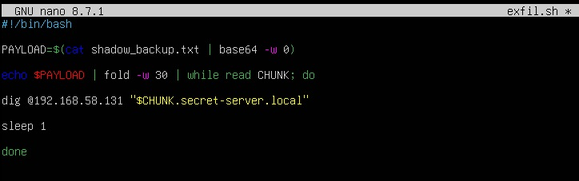
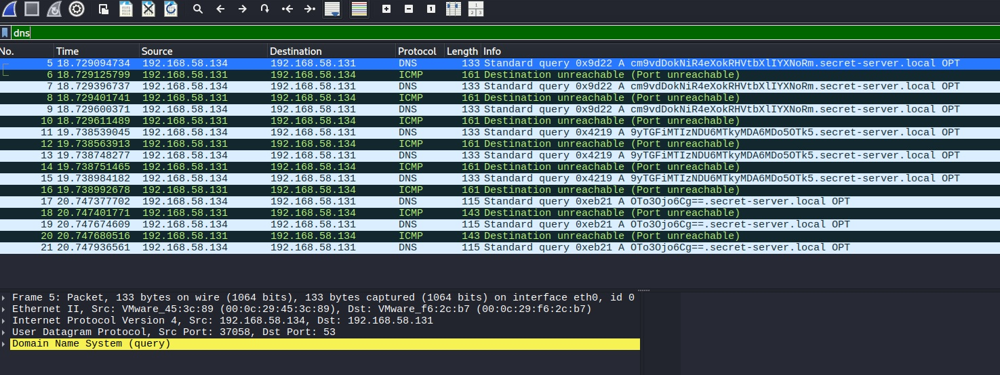
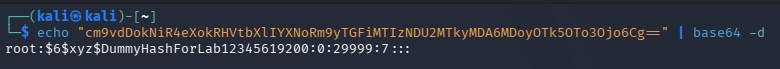

# 📡 Network Forensics Analysis: Detecting DNS Tunneling Exfiltration

**Simulated Role:** SOC Analyst L2 / Threat Hunter  
**Tags:** `Network Forensics`, `Wireshark`, `Threat Hunting`, `DNS Tunneling`, `MITRE ATT&CK`

---

## 📋 Table of Contents
1. [Executive Summary](#1-executive-summary)
2. [Threat Intelligence Context](#2-threat-intelligence-context)
3. [Lab Architecture](#3-lab-architecture)
4. [Execution Methodology (Kill Chain)](#4-execution-methodology-kill-chain)
5. [Network Forensics Analysis](#5-network-forensics-analysis)
   - [5.1. Traffic Pattern & Evasion](#51-traffic-pattern--evasion)
   - [5.2. Evidence Extraction (Wireshark)](#52-evidence-extraction-wireshark)
   - [5.3. Payload Decoding & Impact](#53-payload-decoding--impact)
6. [Detection Engineering (Threat Hunting)](#6-detection-engineering-threat-hunting)
7. [Hardening & Remediation Recommendations](#7-hardening--remediation-recommendations)

---

## 1. Executive Summary

During a controlled simulation in an isolated lab environment, an advanced data exfiltration technique utilizing **DNS Tunneling** was executed and analyzed. The objective of this exercise is to demonstrate how Advanced Persistent Threats (APTs) bypass standard firewall restrictions by encapsulating encoded confidential data within standard DNS queries. The analysis covers the entire lifecycle, from malicious script execution (*Living off the Land*) to packet interception and payload decoding.

**MITRE ATT&CK Mapping:**
* **Tactic:** Exfiltration (TA0010)
* **Technique:** Application Layer Protocol (T1071)
* **Sub-technique:** DNS (T1071.004)

---

## 2. Threat Intelligence Context

The Domain Name System (DNS) is critical for network functionality; therefore, outbound traffic on UDP port 53 is rarely blocked by corporate firewalls. Adversaries exploit this trust by registering malicious domains and forcing compromised internal endpoints to perform DNS lookups against them. By embedding stolen data (encoded in Base64 or Hex) as the requested "subdomain," the data is routed through the organization's legitimate DNS resolvers out to the attacker's authoritative server, effectively bypassing Web Proxies and Data Loss Prevention (DLP) engines.

---

## 3. Lab Architecture

The environment was deployed using virtualization with strict network segmentation.

| Role | Operating System | Simulated IP Address | Tools Used |
| :--- | :--- | :--- | :--- |
| **Attacker / Sensor** | Kali Linux 2026.1 | `192.168.58.131` | Wireshark, Base64 Decoder |
| **Victim Endpoint** | Ubuntu Server 24.04 LTS | `192.168.58.134` | Bash Scripting, `dig`, `fold` |
| **Network Segment** | VMware Virtual Switch (VMnet8) | `192.168.58.0/24` | Wireshark Promiscuous Mode Enabled |

---

## 4. Execution Methodology (Kill Chain)

To emulate an APT, a custom Bash script (`exfil.sh`) was deployed on the compromised endpoint. The script targets a simulated sensitive file containing Linux shadow password hashes.

**Script Logic & Evasion Tactics:**
1.  **Read & Encode:** The target file is read and encoded into a single continuous Base64 string to obfuscate the contents.
2.  **Fragmentation:** Due to RFC 1035 limitations (subdomains cannot exceed 63 characters), the payload is fragmented into 30-character chunks using the `fold` command.
3.  **Exfiltration:** A `while` loop leverages the native `dig` binary to send each chunk as a DNS query to the attacker's IP.
4.  **Rate Limiting:** A `sleep 1` command is injected to intentionally slow down the exfiltration, avoiding volume-based SIEM alerts.

*(Figure 1: Custom LotL Bash script demonstrating payload fragmentation and exfiltration)*

---

## 5. Network Forensics Analysis

The traffic was captured and stored in the `case02.pcapng` file (available in the `/data` folder).

### 5.1. Traffic Pattern & Evasion
The analysis reveals a burst of automated DNS queries. Notably, the pcap also contains ICMP `Destination unreachable (Port unreachable)` packets. This occurs because the simulated attacker machine (Kali) is not running a live DNS service on port 53. However, from an exfiltration standpoint, the attack is successful: the packets containing the payload successfully traversed the network and reached the destination.

### 5.2. Evidence Extraction (Wireshark)
By inspecting the `Info` column in Wireshark, the fragmented Base64 strings are clearly visible prepended to the `.secret-server.local` domain.

*(Figure 2: Wireshark capture showing the burst of DNS queries containing encoded payload chunks)*

### 5.3. Payload Decoding & Impact
To determine the extent of the breach, the analyst extracted the anomalous subdomains, concatenated the Base64 strings, and decoded them. The decoding process successfully exposed the simulated password hashes, proving the total compromise of the credential file.

*(Figure 3: Forensic reconstruction and decoding of the stolen data in the analyst's terminal)*

---

## 6. Detection Engineering (Threat Hunting)

Detecting DNS Tunneling requires behavioral and heuristic analysis, as signatures are easily bypassed by changing the encoding. Security Operation Centers (SOC) should implement the following SIEM alerts:

1.  **Subdomain Length Anomaly:** Alert on DNS queries where the subdomain length exceeds 50 characters (legitimate subdomains are typically much shorter).
2.  **Query Volume Anomaly:** Alert when a single internal IP generates an abnormally high volume of unique DNS requests to a single parent domain within a short timeframe.
3.  **Entropy Analysis:** High entropy in DNS queries indicates encrypted or encoded data rather than human-readable domain names.

---

## 7. Hardening & Remediation Recommendations

To prevent DNS exfiltration in production environments, the following architectural changes are advised:

1.  **Egress Filtering:** Block direct outbound DNS traffic (UDP/TCP port 53) from all internal endpoints to the Internet.
2.  **Internal Resolvers Only:** Force all endpoints to use designated corporate internal DNS resolvers. Only these specific servers should be permitted to query external DNS servers.
3.  **DNS Inspection / Sinkholing:** Implement a DNS Firewall or Next-Generation Firewall (NGFW) to inspect DNS payloads and block known malicious domains or anomalous query patterns.
